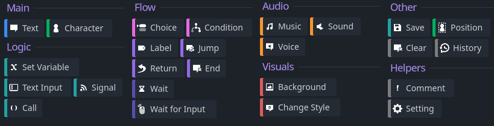
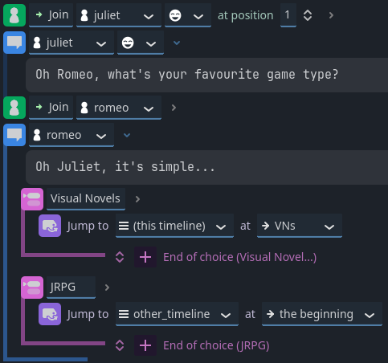
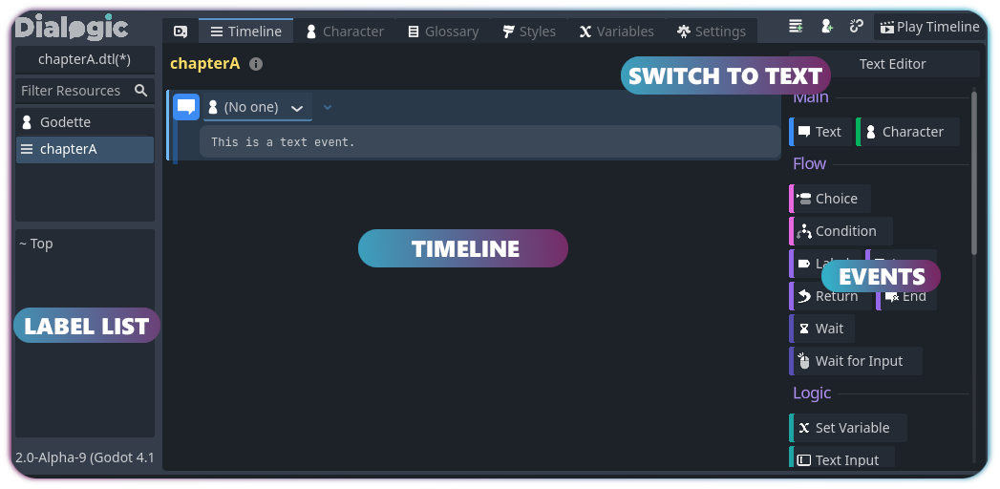
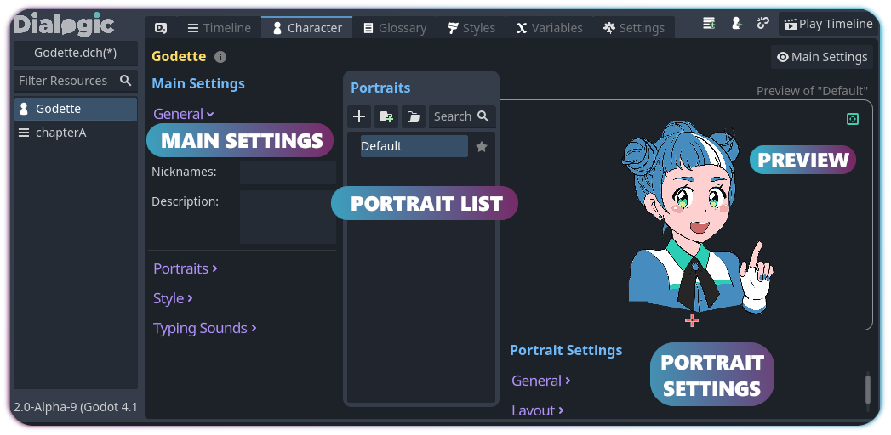

# Guide d'Intégration Dialogic 2 

## Introduction

**Dialogic 2** est un plugin pour Godot Engine 4.2 qui permet de créer des dialogues interactifs facilement, des romans visuels et des dialogues plus complexes. Il s'intègre dans Godot très facilement.

---
Voir le getting started de Dialogic [**_ici_**](https://docs.dialogic.pro/getting-started.html)


## Installation du Plugin

### Prérequis

- Godot Engine 4.2 ou une version ultérieure.
- Un projet Godot .

### Étapes d'installation

1. **Téléchargement**  
   Téléchargez la dernière version de Dialogic depuis la page des [**_releases GitHub_**](https://github.com/dialogic-godot/dialogic/releases).

2. **Extraction**  
   Décompressez l'archive et déplacez le dossier `addons` dans le répertoire racine de votre projet Godot.

3. **Activation du plugin**
   - Ouvrez votre projet Godot.
   - Allez dans `Project > Project Settings > Plugins`.
   - Activez Dialogic

4. **Redémarrage de Godot**  
   Redémarrez l'éditeur pour que les modifications prennent effet.

---

## Configuration dans Godot

### Accès à l'éditeur Dialogic

Une fois le plugin activé, un nouvel onglet Dialogic apparaîtra dans la barre supérieure de Godot, à côté de **2D**, **3D**, **Script** et **AssetLib**.

### Fonctionnalités principales

- **Add Timeline** : Créer une nouvelle séquence de dialogue.
- **Add Character** : Ajouter un nouveau personnage.
- **Reference Manager** : Gérer les références et glossaires.
- **Play Timeline** : Tester le dialogue en temps réel.

---

## Création de dialogues dans Godot

### 1 Créer une timeline

1. Cliquez sur **Add Timeline**.
2. Entrez un nom et choisissez un emplacement pour enregistrer votre fichier `.dtl`.
3. Ajoutez des événements via le panneau de droite.

**Exemple :**

```
join guide
guide: "Bienvenue dans Cat'aclysm ! Êtes-vous prêt ?"
```

 



### 2 Créer un personnage

1. Cliquez sur **Add Character**.
2. Configurez :
   - **Display Name** : Nom affiché à l'écran.
   - **Portraits** : Importez différentes expressions ou images.

Voir [**_plus_**](https://docs.dialogic.pro/characters-and-portraits.html) sur la création de personnages.



### 3 Ajouter du texte et des effets

```
join guide
guide: "Bienvenue, {player_name} !"
pause 1
guide: "Préparez-vous, votre aventure commence maintenant !!!!!"

```
**Explication des commandes**

| Commande        | Description                                     |
|-----------------|-------------------------------------------------|
| `join guide`    | Démarre une session de dialogue avec un guide.  |
| `guide:`        | Définit le texte à afficher dans le dialogue.   |
| `{player_name}` | Insère dynamiquement le nom du joueur.          |
| `pause 1`       | Met en pause le dialogue pendant **1 seconde**. |

---
Voir [**_plus_**](https://docs.dialogic.pro/writing-texts.html) sur les commandes

## Intégration en jeu avec GDScript

Ajoutez ce script à votre scène principale pour lancer un dialogue :

```gdscript
extends Node

func _input(event: InputEvent):
    if Dialogic.current_timeline == null and event.is_action_pressed("ui_accept"):
        Dialogic.start("res://dialogues/mon_premier_dialogue.dtl")
```

---

## Fonctionnalités avancées (certains exemples)

### Effets de texte

- `[pause=1]` : Pause d'une seconde.
- `[speed=0.5]` : Réduction de la vitesse de révélation.
- `[portrait=nom_du_portrait]` : Change l'image affichée.
- `[signal=custom_signal]` : Déclenche un signal spécifique.
- `[n]` : Crée une nouvelle section de texte nécessitant une interaction.

### Variables et conditions

**Variables dynamiques :**

```gdscript
"Bienvenue, {player_name} !"
```

**Conditions :**

```gdscript
[if {has_key}] "Vous avez réussi le tutoriel, passez !"
[else] "Vous n'avez pas fini le tutoriel, poursuivez pour passer à la suite."
```

### Gestion des portraits et humeurs

- Changer de portrait : `[portrait=happy]`
- Modifier le son des frappes : `[mood=angry]`

### Auto-Advance

- Activer l'auto-avance : `[aa]`
- Délai de 5 secondes : `[aa=5]`

Par ici pour [**_plus d'informations_**](https://docs.dialogic.pro/auto-advance.html).

### Déclenchement de signaux

```gdscript
[signal=start_tuto]
```

---

## Pour aller plus loin _(Complément de documentation)_

- [Documentation officielle de Dialogic 2](https://docs.dialogic.pro/)
- [GitHub Dialogic](https://github.com/dialogic-godot/dialogic)

---
